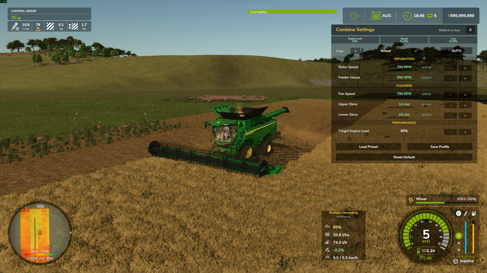
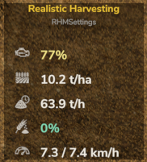
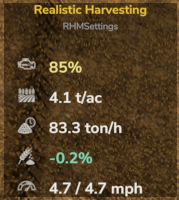
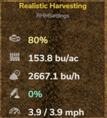
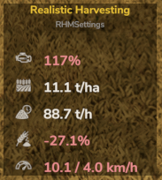
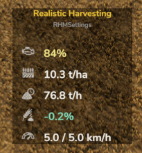
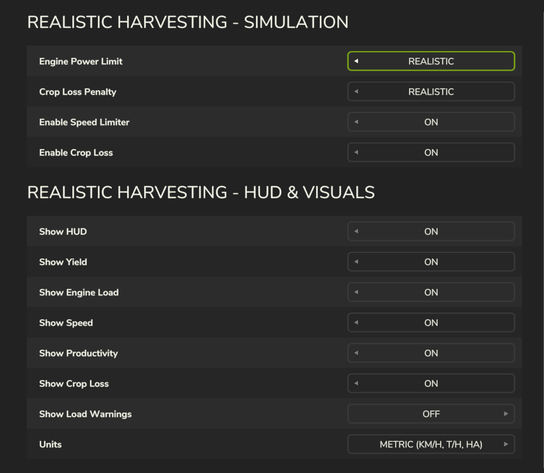
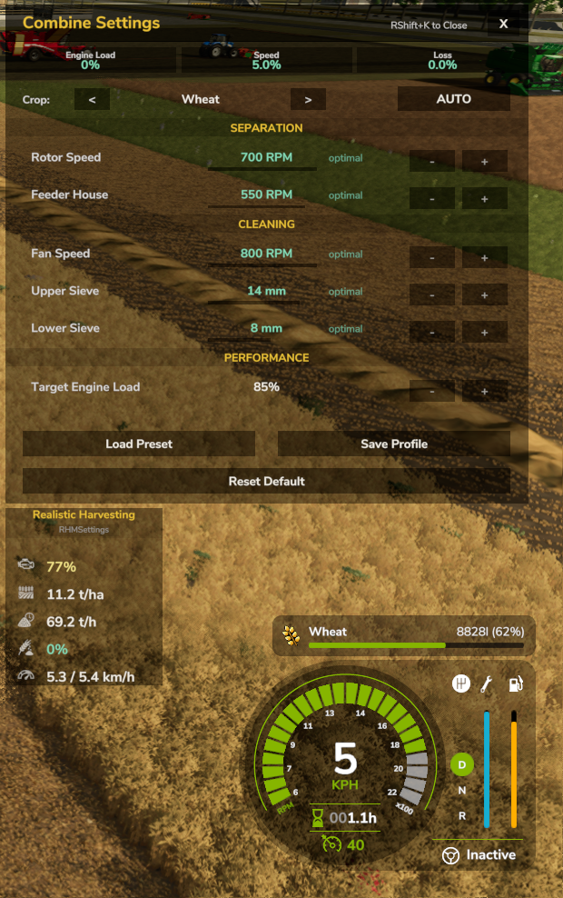
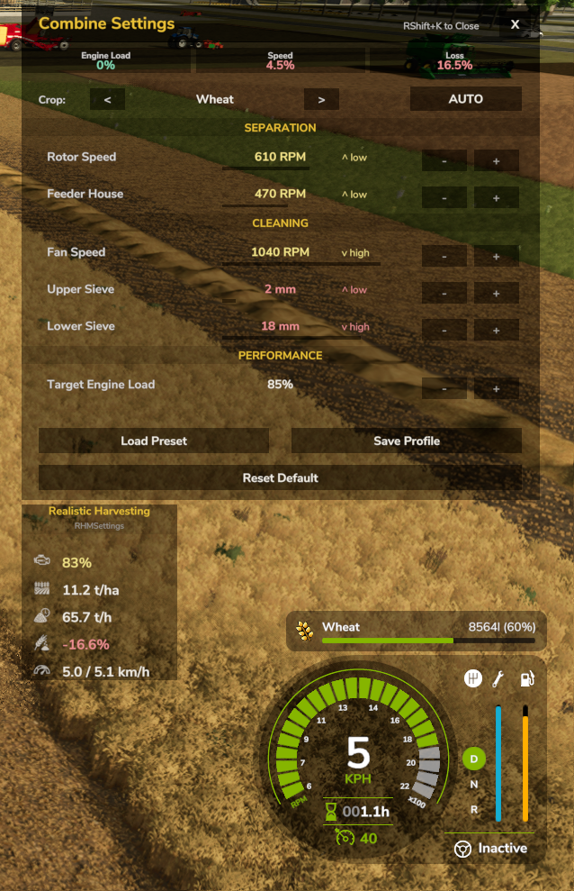

# Realistic Harvesting — Farming Simulator 25

> **Your combine now behaves like a real machine. Push it too hard — and you'll pay the price.**

---

## 📥 Download

**[kingmod.net by exekx](https://www.kingmods.net/en/fs25/mods/73932/realistic-harvesting)**

> Please do not re-upload or redistribute without permission.

---

## What Does This Mod Do?

In vanilla FS25, you can drive at full speed through any crop density with no consequences. **Realistic Harvesting** changes that.

Your combine now has a real engine load that responds to:
- Crop density and type
- Header width
- Terrain slope
- Calibration settings

Drive too fast → engine overloads → you lose grain. Simple.

---

## Quick Start — Your First 5 Minutes

**You don't need to do anything special to start.** The mod works automatically.

1. Enter your combine and start harvesting normally.
2. A **HUD panel** appears on screen with live data.
3. Watch the **Engine Load** bar — keep it below 100%.
4. If Load goes over 95%, **crop losses begin**. Slow down.
5. The mod will automatically suggest a safe speed.

That's it for the basics. Everything else is optional depth.

---

## The HUD — Reading Your Data

The HUD appears automatically when you enter a combine. Right-click to enable cursor and drag it anywhere on screen.

| Indicator | What It Means |
|:---|:---|
| **Engine Load %** | How hard your combine is working. Stay below 95%. |
| **T/h** | Tons per hour — your harvesting productivity. |
| **Yield** | Live t/ha or bu/ac. Fluctuates naturally. |
| **Speed / Rec.** | Your speed vs. the recommended safe speed. |
| **Loss** | LOW / MED / HIGH — how much grain you're losing right now. |

**Color code:** Green = good, Yellow = caution, Red = losing grain.

---

## Crop Loss — How It Works

Losses happen from two sources:

### 1. Overloading (Speed)
- Engine Load > 95% → losses begin
- The faster you push past the limit, the more grain you lose
- Slow down or switch to a narrower header

*High losses — combine going too fast*

*Less grain in the trailer as a result*

*Optimal speed — minimal losses*

*Full trailer when harvesting correctly*

### 2. Poor Calibration (Settings)
If your combine's Fan, Rotor, Sieves, or Feeder are set incorrectly for the current crop, you'll incur a calibration penalty on top of speed losses.

New saves start at **neutral settings (50%)** — safe, but not optimal.

---

## Difficulty Settings

Open: **ESC → Settings → Realistic Harvesting**

### Engine Power
| Mode | Capacity |
|:---|:---:|
| Arcade | 200% — very forgiving |
| Normal | 120% — slight boost |
| Realistic | 100% — real machine specs |

### Crop Loss Severity
| Mode | Penalty |
|:---|:---:|
| Arcade | 50% of standard |
| Normal | Standard |
| Realistic | 200% — very strict |

---

## Combine Calibration (Advanced)

Press **Right Shift + K** while in a combine to open the Calibration Menu.

*Well-calibrated — low loss, high efficiency*

*Poorly calibrated — high loss penalty*

### AUTO vs MANUAL

| | AUTO | MANUAL |
|:---|:---|:---|
| How it works | Sets near-optimal values automatically | You adjust everything yourself |
| Accuracy | Good starting point, intentionally imperfect | Can be perfect — if you know what you're doing |
| Loss penalty | Small (AUTO isn't perfect) | Zero or better — if tuned correctly |

> AUTO is convenient. MANUAL rewards the skilled operator with up to **+2.5% efficiency bonus**.

### How Calibration Affects Loss

The calibration system uses a **continuous curve** for each parameter:

| Position | Effect |
|:---|:---:|
| Exactly at Sweet Spot | +2.5% efficiency bonus |
| Zero Loss zone | 0% |
| Edge of tolerance | −2.5% penalty |
| Beyond tolerance | Increasing penalty |

> All 5 parameters are interconnected — you can't ignore 4 and fix 1.

---

## Zero Loss Settings Reference

These are the ranges where calibration contributes **0% loss** when all parameters are set correctly.

### Standard Grain — Wheat, Barley
| Parameter | Zero Loss Zone |
|:---|:---:|
| **Fan Speed** | 62 – 69 |
| **Rotor Speed** | 72 – 78 |
| **Upper Sieve** | 57 – 63 |
| **Lower Sieve** | 67 – 73 |
| **Feeder House** | 45 – 55 |

### Light Grain — Oat
| Parameter | Zero Loss Zone |
|:---|:---:|
| **Fan Speed** | 67 – 74 |
| **Rotor Speed** | 77 – 83 |
| **Upper Sieve** | 62 – 68 |
| **Lower Sieve** | 72 – 78 |
| **Feeder House** | 50 – 60 |

### Corn (Maize)
| Parameter | Zero Loss Zone |
|:---|:---:|
| **Fan Speed** | 82 – 88 |
| **Rotor Speed** | 88 – 93 |
| **Upper Sieve** | 77 – 83 |
| **Lower Sieve** | 82 – 88 |
| **Feeder House** | 65 – 75 |

### Soybean / Legumes
| Parameter | Zero Loss Zone |
|:---|:---:|
| **Fan Speed** | 47 – 54 |
| **Rotor Speed** | 52 – 58 |
| **Upper Sieve** | 47 – 53 |
| **Lower Sieve** | 57 – 63 |
| **Feeder House** | 31 – 39 |

### Canola (Rapeseed)
| Parameter | Zero Loss Zone |
|:---|:---:|
| **Fan Speed** | 42 – 48 |
| **Rotor Speed** | 57 – 63 |
| **Upper Sieve** | 38 – 42 |
| **Lower Sieve** | 48 – 52 |
| **Feeder House** | 36 – 44 |

### Sunflower
| Parameter | Zero Loss Zone |
|:---|:---:|
| **Fan Speed** | 52 – 59 |
| **Rotor Speed** | 62 – 68 |
| **Upper Sieve** | 67 – 73 |
| **Lower Sieve** | 77 – 83 |
| **Feeder House** | 55 – 65 |

### Rice
| Parameter | Zero Loss Zone |
|:---|:---:|
| **Fan Speed** | 77 – 84 |
| **Rotor Speed** | 82 – 88 |
| **Upper Sieve** | 67 – 73 |
| **Lower Sieve** | 67 – 73 |
| **Feeder House** | 54 – 66 |

### Root Crops — Potato, Sugarbeet
| Parameter | Zero Loss Zone |
|:---|:---:|
| **Fan Speed** | 35 – 45 |
| **Rotor Speed** | 45 – 55 |
| **Upper Sieve** | 75 – 85 |
| **Lower Sieve** | 75 – 85 |
| **Feeder House** | 45 – 55 |

### Vegetables — Carrot, Onion, Beetroot, etc.
| Parameter | Zero Loss Zone |
|:---|:---:|
| **Fan Speed** | 57 – 67 |
| **Rotor Speed** | 52 – 62 |
| **Upper Sieve** | 60 – 70 |
| **Lower Sieve** | 60 – 70 |
| **Feeder House** | 52 – 62 |

---

## Frequently Asked Questions

**Q: My combine is slowing down by itself. Is that normal?**
Yes. The mod automatically limits speed when engine load is too high. This prevents grain loss. You can override it by pressing accelerator harder, but losses will increase.

**Q: I just installed the mod and my settings are all at 50%. Is that bad?**
That's normal — the mod starts at 50% by default until it detects which crop you're harvesting. Once you start harvesting, AUTO mode automatically adjusts settings to near-optimal values for that crop. It's not always perfect though, so there may still be small losses. For zero loss, tune manually using the reference table above.

**Q: Does AUTO mode fully optimize for me?**
No. AUTO is intentionally imperfect. A skilled manual operator can outperform AUTO.

**Q: I lost a lot of grain. How do I prevent it?**
Two main causes: (1) driving too fast — watch the Load bar, (2) wrong calibration — open RShift+K and check your settings for the current crop.

**Q: Does this work in Multiplayer?**
Yes. Speed limiting syncs across all players. Each player has their own HUD settings.

---

## Installation

1. Download from [kingmod.net](https://www.kingmods.net/en/fs25/mods/73932/realistic-harvesting)
2. Place `FS25_RealisticHarvesting.zip` into your `mods` folder
   - Usually: `Documents/My Games/FarmingSimulator2025/mods/`
3. Activate in the in-game Modhub

---

## Credits & Support

**Created by:** exekx

- **Bugs:** [GitHub Issues](https://github.com/exekx/FS25_RealisticHarvesting/issues)
- **Download:** [kingmod.net](https://www.kingmods.net/en/fs25/mods/73932/realistic-harvesting)

**Made with ❤️ for the FS25 Community**

