# Realistic Harvesting — Farming Simulator 25

> **"Your combine now behaves like a real, heavy agricultural machine. Push it too hard — and you'll pay the price."**

---

## 📥 Official Download & Links

- 🌐 **Official Download:** **[kingmods.net by exekx](https://www.kingmods.net/en/fs25/mods/73932/realistic-harvesting)**
- 💬 **Community & Support:** [Discord Server](https://discord.gg/Dc2CvZJqU4)
- 🐛 **Bugs & Suggestions:** [GitHub Issues](https://github.com/exekx/FS25_RealisticHarvesting/issues)
- 🌾 **Recommended Integrations:** [Precision Farming (PF)](https://www.farming-simulator.com/mod.php?mod_id=318936) · [Moisture System](https://www.farming-simulator.com/mod.php?mod_id=354130&title=fs2025)

---

## 🌾 Part I: Mod Overview — What & Why?

### The Problem in Vanilla FS25
In the base game of Farming Simulator 25, combines behave like arcade lawnmowers. You can lower a huge 14-meter cutterbar on an underpowered machine, floor cruise control to 10–12 km/h through dense, high-yielding wheat, and harvest without resistance. There are no engine bog-downs, no calibration penalties, no mechanical physics, and zero grain loss.

### The Realistic Harvesting Solution
**Realistic Harvesting** rebuilds combine physics from the ground up. Harvesters now operate under a **first-principles power-balance physical load engine** based on ASABE engineering standards:

$$P_{total} = P_{base} + P_{header}(v) + P_{process} + P_{soil}$$

1. **$P_{base}$ — Parasitic Mechanical Friction (~8–10% HP):** Driveline drag, hydraulic pumps, and empty rotor/straw chopper inertia.
2. **$P_{header}(v)$ — Cutting & Ingestion Drag:** Power consumption pulled directly from the attached cutterbar's store specs, scaling with cutter width, forward speed ($v$), mechanical knife wear, and live weed infestation drag.
3. **$P_{process}$ — Threshing & Processing Work ($\dot{m} \times E_{spec}$):** Physical energy required to separate grain and chop straw based on incoming mass flow ($\dot{m}$ in tons/hour), crop-specific threshing energy ($E_{spec}$), crop moisture content, and machine mechanical tuning efficiency. Heavy straw cereals require far more horsepower than canola or dry corn.
4. **$P_{soil}$ — Terrain Slope & Lifting Resistance:** Climbing steep hills draws driveline torque. For root crop harvesters, lifting tons of soil mass draws active ground-lifting horsepower ($7.0\text{ HP/m}$).

If total required power approaches engine capacity, the combine automatically slows down to protect the threshing drum. If you turn off the limiter or push past 95–100% load, **physical grain loss begins spilling behind the machine**, and an in-cabin warning chime sounds!

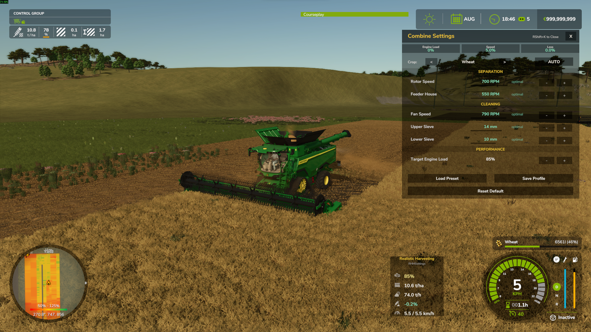
*Authentic field operation: the harvester dynamically throttles ground speed based on crop density, live engine load, and field terrain.*

---

### 🌟 Key Feature Highlights (v1.6.2.0)

- **Dynamic Speed Limiting & Cruise Control Regulation:** Automatically maintains optimal engine throughput, featuring an intelligent deadband ($\pm 0.15\text{ km/h}$) that prevents throttle surging and engine hunting.
- **Hydrostatic Transmission Smoothing & Crop Speed Memory:** Smooth Hermite S-curve entry ramp prevents jerky stops when entering thick stands, and rolling speed memory remembers your working pace across headland turns.
- **Progressive Crop Loss Model:** Safe under 80% load, minimal loss between 80–100%, and steep exponential losses above 100% when separator shoes choke.
- **Live Weed Canopy Drag & Visual HUD Indicator:** Cutterbars sample live weed density across the working swath. Thick weed patches draw up to +15% PTO resistance and increase separator load, tracked live on the HUD.
- **Terrain Slope Losses & Knife Wear Physics:** Steep inclines induce grain cascade loss over sieves, while dull cutterbars and worn rotor bars decrease threshing efficiency and increase fuel consumption.
- **Authentic Cabin Computer Warning Chime:** Gentle, realistic agricultural terminal alert chimes (Deutz-Fahr iMonitor acoustic profile) with Smart 3-beep cadence (0.30s pulse, 18s grace period).
- **Interactive In-Cab Mouse Cursor (`Middle Mouse Button / MMB`):** Instantly unlock the mouse cursor directly inside the cab without opening menus to reposition or click-cycle HUD cells. Features a 250ms debounce guard and leaves Right Mouse Button completely free for third-party tools.
- **Dual-Layer HUD Interaction:** Small telemetry HUD can be freely repositioned and clicked while the calibration tablet (`Right Shift + K`) is open.
- **4-Tier Shop Electronics Progression:** Upgrade from basic factory mechanical controls to sensors, yield monitors, and Opti-Harvest AI Autopilot.
- **Interactive Touchscreen Calibration Terminal (`Right Shift + K`):** Real-time adjustment of rotor speed, concave clearance, cleaning fan, upper/lower sieves, and target engine load. Can even be opened while AI or Courseplay is driving!
- **Fullscreen Harvest Records & Fleet Analytics Terminal (`Right Shift + J`):** Multi-tab management suite featuring field trip counters, full farm acreage production tables, live fleet telemetry with machine wear %, seasonal archives, and diagnostic loss root cause breakdowns.
- **Smart Field Trip Odometer Auto-Reset:** Seamlessly resets trip acreage upon switching fields or crops, protected against false triggers across merged fields.
- **Comprehensive 11-Chapter In-Game Handbook (`ESC → In-Game Help`):** Complete guide localized into all 27 languages with custom high-DPI icons from `rhm_atlas`.
- **Zero-Gap Magnetic HUD Docking:** Telemetry HUD automatically docks seamlessly underneath the Precision Farming yield box or the F1 menu.
- **100% Savegame Persistence:** All slider values, chosen crops, machine trip counters, and fleet history records are permanently stored in career savegame XML.

---

## 🎮 Part II: Player's Mini-Guide (How to Play)

### Step 1: Quick Start (Your First 5 Minutes)
1. **Purchase or lease a combine** in the shop and attach a compatible cutterbar.
2. Enter the cabin and lower the header into the crop.
3. The **telemetry HUD** appears automatically in the top-left corner, magnetically docked under Precision Farming or the F1 help box.
4. **Watch the Engine Load indicator:**
   - 🟢 **Under 80% (Green):** Optimal safe zone — **0.0% crop loss**.
   - 🟡 **80% – 95% (Yellow):** High throughput — minor operational losses (~0.5–2%).
   - 🔴 **Above 95% (Red Alert):** Critical overload! The machine will slow down. Pushing past **95–98%** triggers the in-cabin alert chime.
5. Press **Middle Mouse Button (MMB / wheel click)** to unlock the in-cab cursor and drag the HUD anywhere on your screen.
6. Press **Right Shift + K** at any time to open the **Calibration Terminal** and tune your machine.
7. Press **Right Shift + J** to open the **Harvest Records & Fleet Analytics** journal.
8. Press **Right Shift + H** to toggle the telemetry HUD overlay on or off.

---

### Step 2: Reading the 4-Column Telemetry HUD

The horizontal HUD bar gives you instant, non-intrusive feedback organized into 4 customizable cells:

| Cell 1: Engine Load | Cell 2: Speed / Losses | Cell 3: Moisture / Weeds | Cell 4: Field Metrics |
|:---:|:---:|:---:|:---:|
|  |  |  |  |

#### HUD Cells Breakdown:

| Cell | Metric / Display | Meaning & In-Game Behavior |
|:---:|:---|:---|
| **1** | **Engine Load %** | Mechanical strain on the engine (0–100%+). Underlined with an adaptive stress bar (white → yellow → pulsing red alert). 🟢 Safe under 80%, 🟡 Warning at 80–95%, 🔴 Overload above 95%. |
| **2** | **Crop Loss % / Speed** | **Loss View:** Live grain loss percentage alongside predicted target limit (`[A] 0.6%`). **Speed View:** Current ground speed alongside dynamic speed limit (`0.0 / 5.5 km/h`). *(Click cell to toggle view)* |
| **3** | **Weed Density / Moisture** | **Weed View:** Live canopy weed infestation percentage across the cutterbar width (`0.0%`). High weeds draw engine drag. **Moisture View:** Crop moisture percentage with rain/dew impact. *(Click cell to toggle view)* |
| **4** | **Field Yield / Work Rate / TPH** | **Yield View:** Swath yield and accumulated field trip mass (`t/ha \| 221.5 t`). **Work Rate View:** Working acreage rate (`ha/h \| 18.1 ha`). **Throughput View:** Processed tons per hour (`t/h \| 221.5 t`). *(Click cell to cycle view)* |

> 💡 **Interactive HUD Controls:**
> - **In-Cab Cursor:** Click **Middle Mouse Button (MMB)** while driving to bring up the cursor. Camera rotation is cleanly frozen so you can click any HUD cell to switch its metric or drag the HUD bar to a new position. Click MMB again to close.
> - **Dual-Layer Passthrough:** You can also reposition or click the HUD while the Shift+K calibration tablet is open!
> - **Automatic Magnetic Docking:** Dragging the HUD near the Precision Farming yield box or top screen edge automatically snaps it back into place.

---

### Step 3: Understanding Crop Loss, Weeds & Audio Alarms

Grain losses occur from distinct physical causes, fully modeled by the RHM engine:

1. **Overload Losses (Driving Too Fast / Excessive Mass Flow):**
   - **0% to 80% Load:** Safe operating zone — **0.0% crop loss**.
   - **80% to 100% Load:** Progressive capacity boundary — minor loss (~0.1% to 2.0%).
   - **100% to 110% Load:** High throughput territory — moderate loss (~2.0% to 4.5%).
   - **Above 110% Load:** Severe choking of threshing drum and sieves — exponential losses (up to 50%).
2. **Calibration Losses (Misaligned Machine Settings):**
   - **Rotor Speed / Concave Clearance:** Poor threshing either leaves grain unthreshed in heads or overworks the engine (`Efficiency -%`). Optimal tuning yields up to a **+5.0% Speed Bonus**.
   - **Fan Speed & Sieves:** Excessive fan air blows clean grain out the rear; weak fan air clogs the cleaning shoe with chaff.
3. **Environmental & Mechanical Drag:**
   - **Weed Resistance:** Weeds tangled in the cutterbar and drum draw up to +15% extra engine horsepower and increase separation resistance.
   - **Slope Cascade Losses:** Harvesting across steep hills causes grain to slide to the lower side of sieves, causing localized overloading.
   - **Mechanical Wear Degradation:** Dull cutterbar knives and worn rotor bars reduce cutting efficiency and increase power consumption.
4. **Cabin Terminal Alert Audio System:**
   - Sounds authentic agricultural terminal chimes inside the cockpit whenever **Engine Load > 95%** or **Crop Loss > 4.0%**.
   - **Smart Mode Rhythm:** Plays 3 short acoustic pulses (0.30s) followed by an 18-second grace period so alarms remain informative without becoming annoying.

---

### Step 4: Machine Shop Progression (RHM Electronics Tiers)

When buying or leasing equipment, select an **RHM Electronics** package to match your farm's budget:

| Tier | Package Name | Price | Player Manual Driving | AI Worker & Autopilot Behavior |
|:---:|:---|:---:|:---|:---|
| **1** | **Basic Mechanical** | Free | Base physics & auto-limiter. Factory baseline variance (~50% ± 8%). Strictly manual control. | **±18% setting variance** (inexperienced helper; higher losses and lower field speed). |
| **2** | **Sensor Kit** | $3,500 | Adds live Yield (`t/ha`), Productivity (`t/h`), and green optimal target guides on sliders. | **±10% setting variance** (moderate competence). |
| **3** | **Yield & Loss Monitor** | $8,500 | Adds live Crop Loss %, Moisture telemetry, and **custom crop profile saving**. | **±4% setting variance** (experienced operator; near zero loss). |
| **4** | **Opti-Harvest AI** | $15,000 | Unlocks the **`AI AUTO-CALIB`** one-click calibration button + continuous live dynamic auto-trimming. | **0% flawless factory settings** + continuous live micro-trimming during harvest! |

> 📌 **Contract Machinery:** Leased equipment for contracts spawns in the baseline configuration (**Tier 1 Basic Mechanical**). Invest in your farm's own fleet to unlock yield monitors and Opti-Harvest AI!

---

### Step 5: The Calibration Terminal (`Right Shift + K`)

Open the interactive tablet at any time (even while an AI worker or Courseplay is actively harvesting):

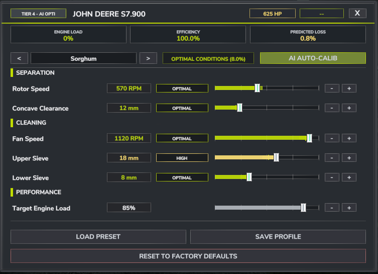

| Well-Calibrated Combine (Tier 4 / Profile) | Uncalibrated Baseline (Factory Fresh) |
|:---:|:---:|
| 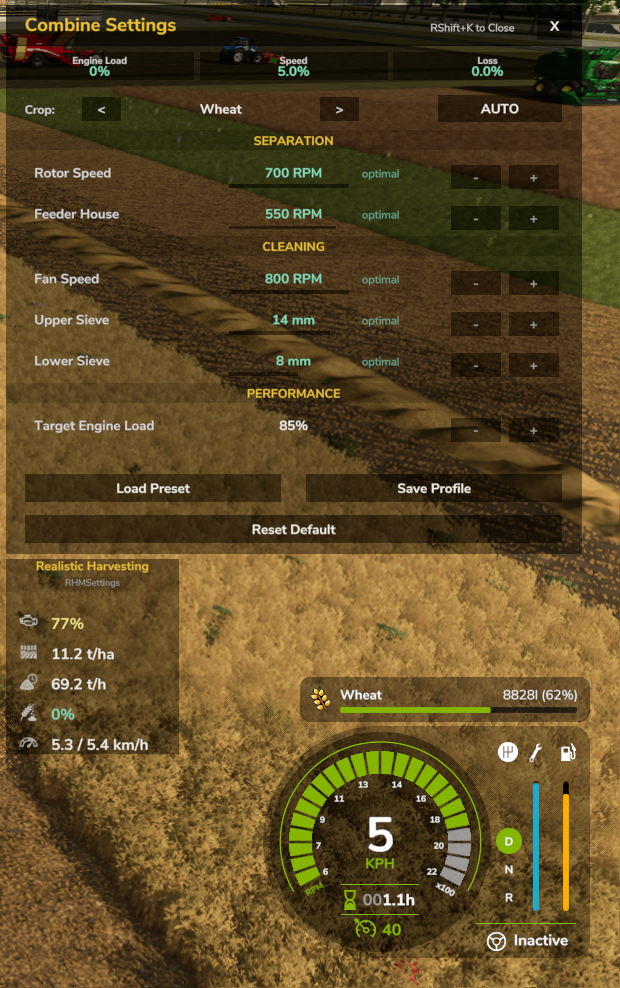 | 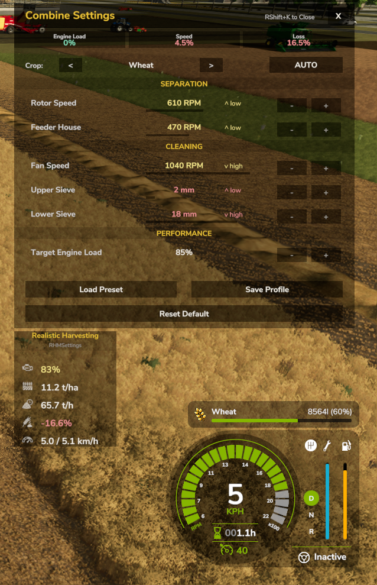 |
| *Zero loss (0.0%), maximum efficiency, optimal green bars* | *High predicted loss (9.1%), negative efficiency (-6.2%)* |

#### Parameters Explained:
- **Top Telemetry Cards:**
  - `ENGINE LOAD`: Live mechanical strain on the engine.
  - `EFFICIENCY`: Separation efficiency (+5% bonus when optimal; negative efficiency costs engine power).
  - `PREDICTED LOSS`: Expected cleaning shoe grain loss with current fan and sieve settings.
- **SEPARATION:**
  - `Rotor Speed`: Threshing drum speed (RPM). High for small wet grains; lower for corn and sunflowers.
  - `Concave Clearance`: Distance between threshing cylinder and concave (mm).
- **CLEANING:**
  - `Fan Speed`: Blower air volume (RPM) separating chaff from seed.
  - `Upper Sieve` & `Lower Sieve`: Chaffer and sieve openings (mm).
- **PERFORMANCE:**
  - `Target Engine Load`: Setpoint for cruise control throttling (default: **85–88%**).
- **Profile Controls:**
  - `SAVE PROFILE`: Saves current settings for the active crop.
  - `LOAD PRESET`: Loads your previously saved profile.
  - `RESET TO FACTORY DEFAULTS`: Restores factory baseline.
  - `AI AUTO-CALIB`: Unlocked on Tier 4. Harvest 5–10 meters in the field to gather stream telemetry, open Shift+K, and click for instant zero-loss calibration!

---

### Step 6: Harvest Records & Fleet Analytics (`Right Shift + J`)

Press **Right Shift + J** to open the fullscreen fleet management and agronomic analytics suite:

#### Tab 1: Current Field / Job Counter
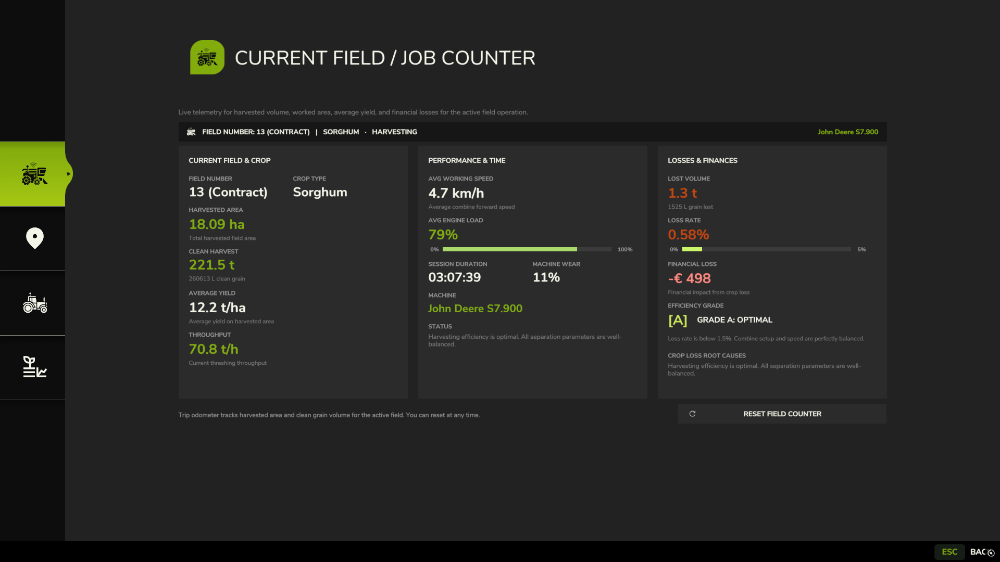
- **Live Trip Odometer:** Tracks active field area (ha), clean harvested mass (t), average yield (t/ha), live throughput (t/h), engine load gauge, machine wear %, and financial impact of grain losses.
- **Quick Reset:** Press the on-screen **RESET FIELD COUNTER** button or hold **Right Shift + R** in the cab for 1.5 seconds.

#### Tab 2: Farm Fields Production Overview
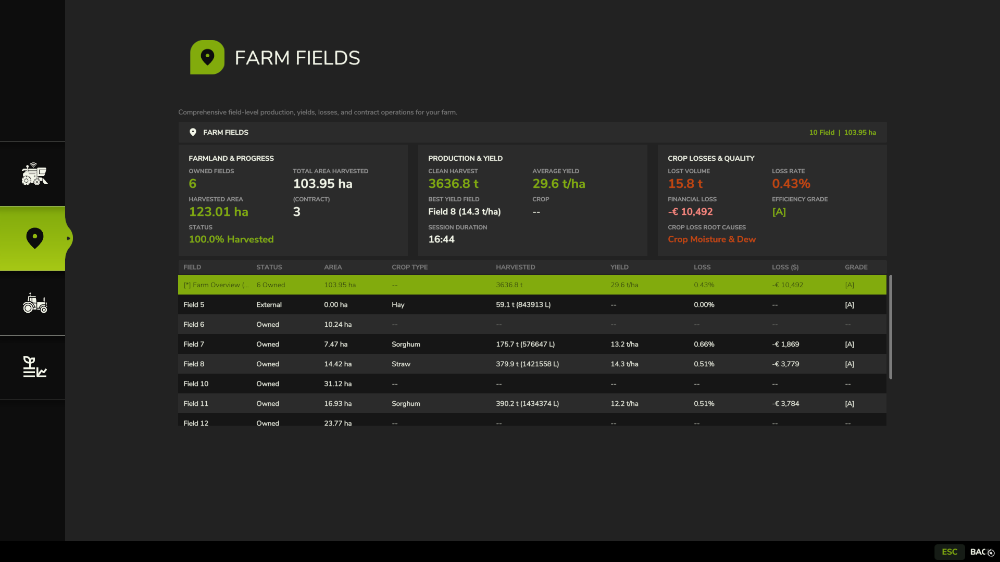
- **Farm-Wide Production KPI Cards:** Tracks total acreage harvested across owned land and contracts, total clean tons produced, average yield across all fields, and financial grain loss tally.
- **Per-Field Detailed Table:** Sort and inspect individual field records with harvested crop type, yields, losses, and efficiency grades.

#### Tab 3: Combine Fleet & Seasonal Archive
| Active Fleet Telemetry | Seasonal Historical Operations | Sold Harvesters Archive |
|:---:|:---:|:---:|
| 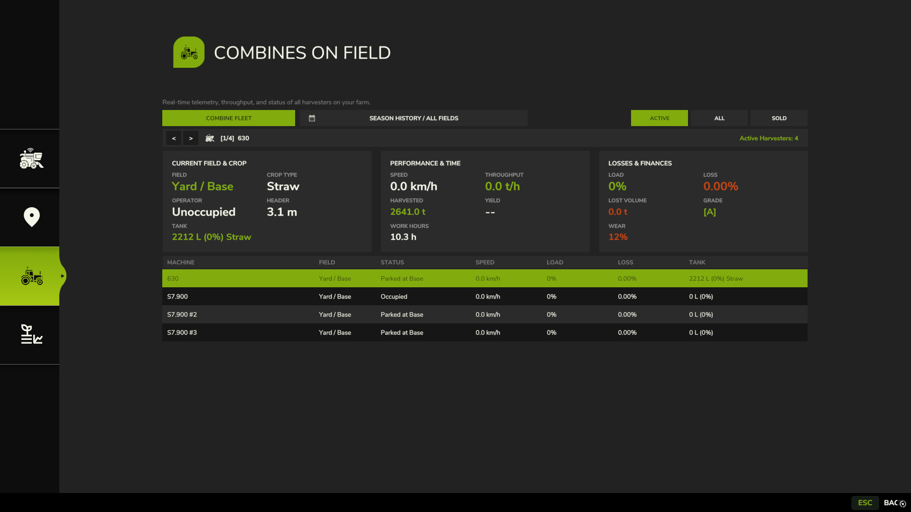 | 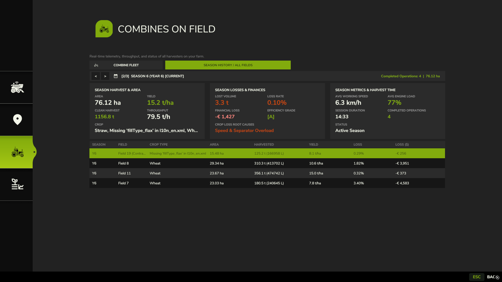 | 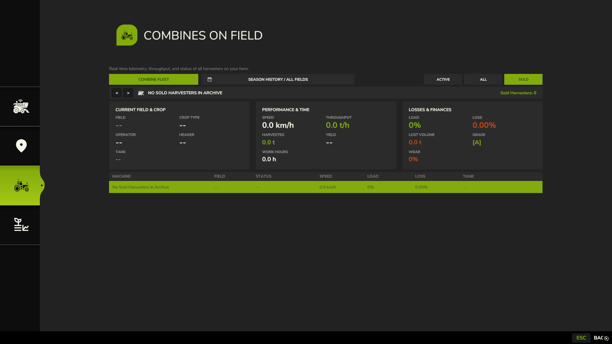 |
| *Live machine telemetry, wear %, operator, tank level* | *Yearly seasonal operations and acreage archive* | *Historical record of decommissioned machines* |

- **Multi-Vehicle Support:** Seamlessly monitors all combines on your farm, including rented/leased units and contract machines.
- **Auto-Pruning:** Rented and mission harvesters are cleanly removed from the active fleet upon return without cluttering records.

#### Tab 4: Loss Root Causes & Operator Scorecard
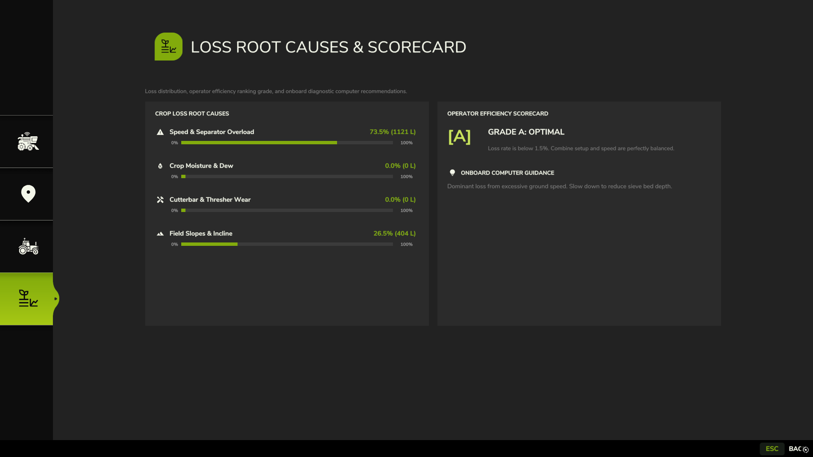
- **Loss Diagnostics Breakdown:** Visual progress bars attribute losses directly to physical causes:
  1. *Speed & Separator Overload*
  2. *Crop Moisture & Dew*
  3. *Cutterbar & Thresher Wear*
  4. *Field Slopes & Incline*
- **Operator Scorecard:** Generates an official efficiency grade (**[A] Optimal**, **[B] Acceptable**, **[C] Deficient**) alongside diagnostic computer guidance on how to improve.

---

### Step 7: AI Workers & Autopilot Integration

Hired hands and automated drivers interact realistically with your combine's electronics:

- **Protecting Your Settings (`AI Helper Tuning`):**
  - Go to `ESC → Game Settings → Realistic Harvesting - Simulation`.
  - Set **AI Helper Tuning** to **`Keep Player Settings`**.
  - Now, hired helpers and autopilots will **never overwrite** your manually tuned sliders or saved profiles!
- **Automated AI Tuning (`Always Auto-Tune`):**
  - When enabled, helpers automatically tune the combine based on the installed Electronics Tier (Tier 1: ±18%, Tier 2: ±10%, Tier 3: ±4%, Tier 4: 0% optimal).
- **On-the-Fly Terminal Inspection:**
  - Press **Right Shift + K** while an AI worker is driving to inspect live load and losses, or manually fine-tune settings without stopping work.
- **Unified Field Statistics:**
  - The trip odometer and field journal aggregate acreage worked by both player and AI workers seamlessly into a single field record.

---

### Step 8: Mod Configuration (`ESC` Menu)

Settings are organized cleanly across game pause menus:

| Simulation Settings (`ESC → Game Settings`) | HUD & Visuals (`ESC → General Settings`) | Audio Settings (`ESC → General Settings`) |
|:---:|:---:|:---:|
| 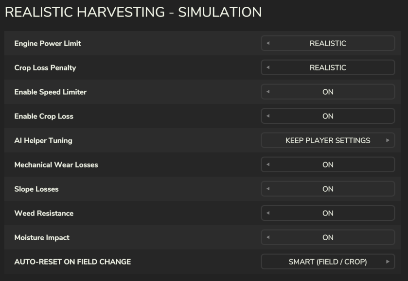 | 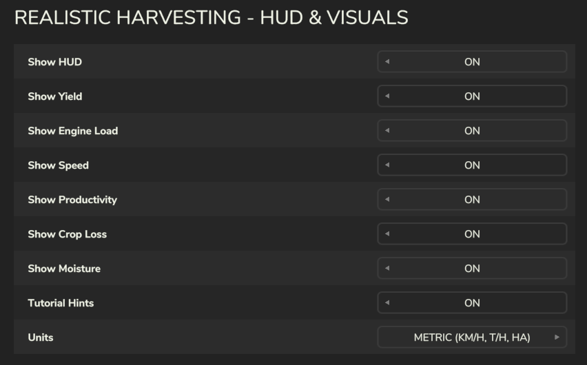 | 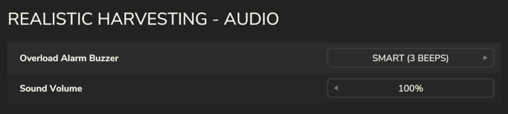 |
| *Server/Admin physics rules & toggles* | *Personal HUD display & measurement units* | *In-cab alert chime volume & cadence* |

#### ⚙️ Simulation Settings (Server & Host Controlled)
| Setting | Options | Description |
|:---|:---:|:---|
| **Engine Power Limit** | Arcade (200%) / Normal (120%) / Realistic (100%) | Scales combine processing capacity |
| **Crop Loss Penalty** | Arcade (50%) / Normal (100%) / Realistic (200%) | Scales overload and calibration crop losses |
| **Enable Speed Limiter** | ON / OFF | Automatically regulates cruise control to protect the threshing drum |
| **Enable Crop Loss** | ON / OFF | Enables or disables physical grain loss spilling onto the ground |
| **AI Helper Tuning** | Keep Player Settings / Always Auto-Tune / Disabled | Controls helper calibration behavior |
| **Mechanical Wear Losses** | ON / OFF | Enables knife and rotor wear degradation |
| **Slope Losses** | ON / OFF | Enables hillside cascade losses on slopes |
| **Weed Resistance** | ON / OFF | Enables cutterbar and separator drag from weeds |
| **Moisture Impact** | ON / OFF | Enables moisture resistance and separation penalties |
| **Auto-Reset on Field Change**| Smart (Field / Crop) / Crop Change Only / Manual | Controls trip odometer auto-reset behavior |

#### 📊 HUD & Visuals Settings (Personal per Player)
| Setting | Options | Description |
|:---|:---:|:---|
| **Show HUD** | ON / OFF | Master toggle for the telemetry HUD panel |
| **HUD Metric Toggles** | ON / OFF | Toggle Yield, Engine Load, Speed, Productivity, Loss, and Moisture cells |
| **Tutorial Hints** | ON / OFF | Contextual on-screen onboarding banners and tips |
| **Units** | Metric / Imperial / Bushels | Measurement systems: Metric (`km/h, t/ha, t/h`), Imperial (`mph, ton/ac, ton/h`), Bushels (`mph, bu/ac, bu/h`) |

#### 🔊 Audio Settings (Personal per Player)
| Setting | Options | Description |
|:---|:---:|:---|
| **Overload Alarm Buzzer** | Smart (3 Beeps) / Continuous / OFF | In-cab alert chime during critical overload (>95%) or high loss (>4%) |
| **Sound Volume** | 0% – 100% | Adjusts warning alarm master volume with in-cab camera gating |

---

## 🌾 Part III: Supported Machine Types & In-Game Handbook

Realistic Harvesting features a complete 11-chapter interactive handbook accessible anytime via `ESC → In-Game Help → Realistic Harvesting`:

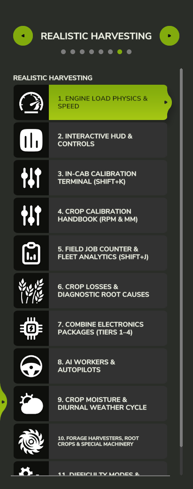

### 1. Grain Combines — 5 Parameters
*(Fan Speed · Rotor Speed · Upper Sieve · Lower Sieve · Concave Clearance)*

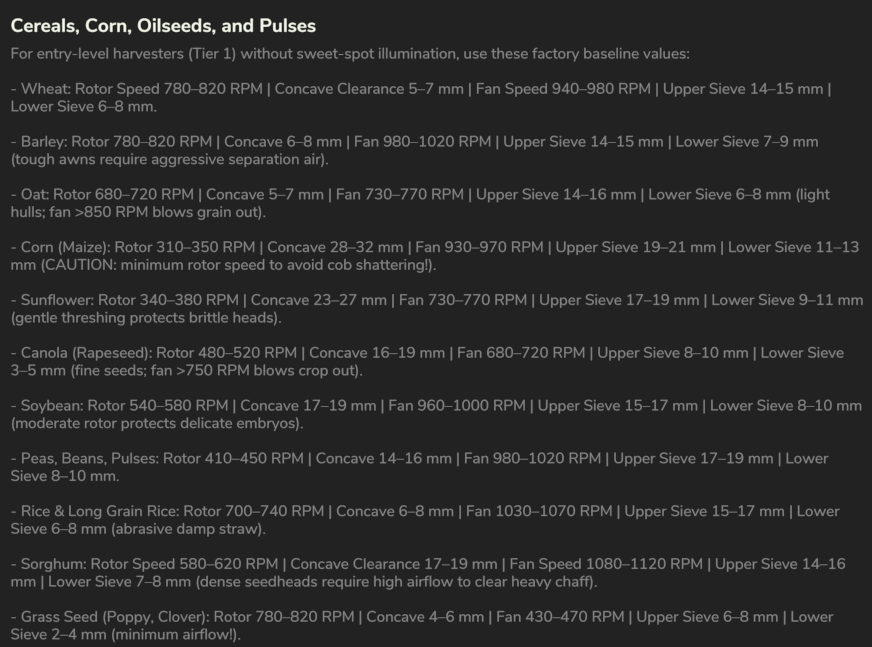

| Crop | Fan Speed (RPM) | Rotor Speed (RPM) | Upper Sieve (mm) | Lower Sieve (mm) | Concave Clearance (mm) |
|:---|:---:|:---:|:---:|:---:|:---:|
| **Wheat / Barley** | 940–980 | 780–820 | 14–15 | 6–8 | 5–7 |
| **Oat** | 730–770 | 680–720 | 14–16 | 6–8 | 5–7 |
| **Corn (Maize)** | 930–970 | 310–350 | 19–21 | 11–13 | 28–32 |
| **Canola (Rapeseed)** | 680–720 | 480–520 | 8–10 | 3–5 | 16–19 |
| **Sunflower** | 730–770 | 340–380 | 17–19 | 9–11 | 23–27 |
| **Soybean** | 960–1000 | 540–580 | 15–17 | 8–10 | 17–19 |
| **Peas / Beans / Pulses** | 980–1020 | 410–450 | 17–19 | 8–10 | 14–16 |
| **Rice & Long Grain Rice** | 1030–1070 | 700–740 | 15–17 | 6–8 | 6–8 |
| **Sorghum** | 1080–1120 | 580–620 | 14–16 | 7–8 | 17–19 |
| **Grass Seed / Poppy / Clover**| 430–470 | 780–820 | 6–8 | 2–4 | 4–6 |

---

### 2. Modded Crops & Custom Maps Auto-Discovery
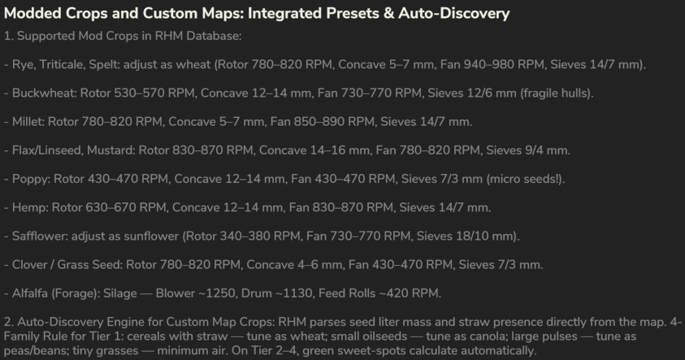
- **Built-In Presets for 25+ Crops:** Rye, Triticale, Spelt, Buckwheat, Millet, Flax/Linseed, Mustard, Poppy, Hemp, Safflower, Clover, Alfalfa.
- **Dynamic 4-Family Auto-Discovery Engine:** For unmapped custom crops on mod maps, RHM parses seed liter mass and straw presence directly from the map XML, categorizing them into cereals, small oilseeds, large pulses, or tiny grasses with automatic optimal green sweet-spots.

---

### 3. Forage Harvesters, Root Crops & Specialized Machinery
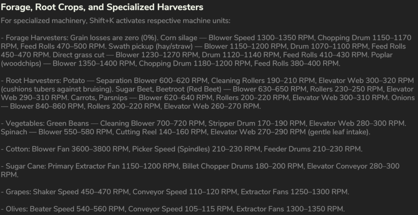

- **Forage Harvesters (3 Parameters):** Blower Speed, Chopping Drum, and Feed Rolls. Calibrated for Corn Silage, Swath pickup, Direct grass cut, and Poplar (woodchips).
- **Root Harvesters (3 Parameters):** Separation Blower, Cleaning Rollers, and Elevator Web. Calibrated for Potatoes, Sugar Beets, Beetroot, Carrots, Parsnips, and Onions.
- **Vegetables:** Calibrated for Green Beans (stripper drum) and Spinach (cutting reel).
- **Specialty Harvesters:** Cotton pickers (blower, picker spindles, feeder drums), Sugarcane (extractor fan, chopper drums, elevator), Grapes & Olives (shaker speed, conveyor, extractors).

---

### 4. Crop Moisture & Diurnal Weather Cycle
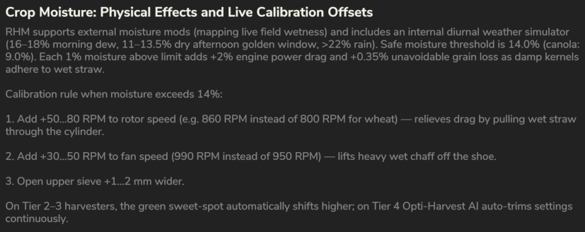
- Includes internal diurnal weather simulator (morning dew 16–18%, afternoon dry golden window 11–13.5%, rain >22%).
- Safe moisture threshold: **14.0%** (Canola: **9.0%**). Each 1% moisture above limit adds +2% engine power drag and +0.35% unavoidable grain loss.
- In-cab offsets: Increase rotor speed (+50...80 RPM), increase fan speed (+30...50 RPM), and open upper sieve (+1...2 mm).

---

## 🔗 Part IV: Ecosystem & Mod Compatibility

- **[Precision Farming (PF)](https://www.farming-simulator.com/mod.php?mod_id=318936):** Native dynamic yield scaling across variable soil types and nitrogen zones. Includes zero-gap magnetic HUD docking beneath the PF yield box.
- **[Moisture System](https://www.farming-simulator.com/mod.php?mod_id=354130&title=fs2025):** Live HUD moisture tracking, dynamic wet crop load resistance, and separation penalties.
- **Swathing / Windrow Pickups:** Automatically detected; cutterbar knife drag ($P_{header}$) drops to zero, computing power purely from intake swath volume.
- **Modular Platforms (NEXAT):** Full vehicle hierarchy search resolves the true engine horsepower across modular gantry carriers and attachments.
- **Public Integration API (`RHM_Api`):** Dedicated read-only API methods allowing third-party dashboards and telemetry mods to safely access engine load, crop losses, moisture, electronics tiers, and cursor states.

---

## ❓ Frequently Asked Questions (FAQ)

**Q: My combine slows down automatically in dense spots. Is that normal?**  
Yes! If the Speed Limiter is active, the cruise control automatically down-throttles to prevent the threshing drum from plugging and avoid grain loss.

**Q: How do I unlock the mouse cursor to move the HUD?**  
Click **Middle Mouse Button (MMB / wheel click)** while driving to bring up the cursor and freeze camera rotation. Drag the HUD to your preferred position, or click individual cells to cycle metrics. Click MMB again to restore steering/camera controls. You can also drag the HUD while the Shift+K tablet is open!

**Q: How do I reset the field trip counter?**  
Open the Harvest Records journal (**Right Shift + J**) and click **RESET FIELD COUNTER**, or hold **Right Shift + R** in the cab for 1.5 seconds. You can also configure auto-reset on field change in `ESC → Game Settings`.

**Q: Why do my combine sliders start at ~50% when purchased?**  
Real machines arrive from the factory in a neutral transport baseline (~50% ± 8%). On Tiers 1–3, tune them manually or load a profile; on Tier 4, click **AI AUTO-CALIB**.

**Q: How does the in-cabin alarm chime work?**  
An audible warning sounds inside the cabin whenever **Engine Load > 95%** or **Crop Loss > 4.0%**. You can adjust volume or choose the Smart 3-beep cadence in `ESC → General Settings → Realistic Harvesting - Audio`.

**Q: Can I open the calibration menu while an AI worker or Courseplay is driving?**  
Yes! Press **Right Shift + K** at any time to monitor telemetry or adjust sliders on the fly.

**Q: How do I prevent AI helpers from overwriting my settings?**  
In `ESC → Game Settings → Realistic Harvesting - Simulation`, set **AI Helper Tuning** to **`Keep Player Settings`**.

**Q: Where can I find in-game help?**  
Open `ESC → In-Game Help` to read the built-in 11-page handbook translated into all 27 languages!

---

## 💾 Installation

1. Download the latest release from **[kingmods.net](https://www.kingmods.net/en/fs25/mods/73932/realistic-harvesting)**
2. Place `FS25_RealisticHarvesting.zip` into your `mods` folder:
   - Typically: `Documents/My Games/FarmingSimulator2025/mods/`
3. Activate the mod in the in-game Modhub / Mod selection screen.

---

## 👥 Credits & Support

**Created by:** exekx

- 🌐 **Official Download:** [kingmods.net](https://www.kingmods.net/en/fs25/mods/73932/realistic-harvesting)
- 💬 **Community & Support:** [Discord Server](https://discord.gg/Dc2CvZJqU4)
- 🐛 **Bugs & Suggestions:** [GitHub Issues](https://github.com/exekx/FS25_RealisticHarvesting/issues)

---

### ☕ Support Ongoing Development
If you enjoy the enhanced harvesting physics and want to support further development and new features:

---

**Made with ❤️ for the FS25 Harvesting Community**

